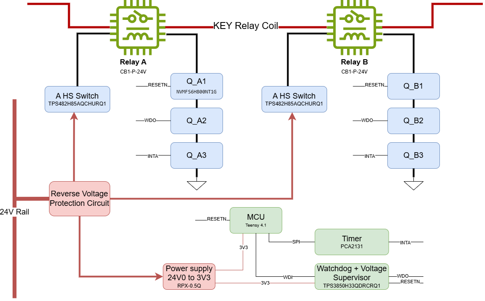
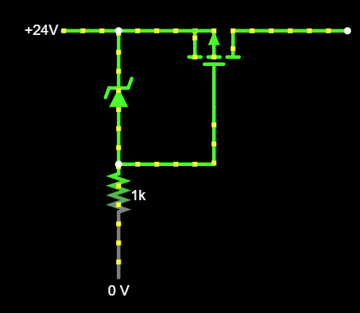

# Platform Hardware — Design & Layout Notes

> Pillar 1 of 3 · handle **Safe state** · [↑ overview](../README.md) · [← README](README.md)

## Overview

## Block Diagram

Two independent cutoff channels (A, B) in series on the **24 V_P** rail. Each channel:
high-side switch (latch-off) → relay coil → three series enable gates that are pulled to
ground unless actively held high. Both channels must conduct for the relays to energize.

 

> Every gate (Q_*) has a **10k pulldown** — default/fault state is open (motors-off).
> `Power OK`, `Watchdog OK`, and `Timer OK` each gate the corresponding stage in **both**
> channels.

## Scheme Notes

### General
- Off state is safe: all command lines are Active HIGH
- Sense every command line
### Relay
- Add Flyback Diode

### Reverse Voltage Protection

> A series P-channel MOSFET blocks current when the supply is connected with reversed
> polarity, protecting downstream circuitry. Under correct polarity the FET is held on and
> drops far less voltage than a diode, guarding against reverse connection with minimal loss. With Zener diode that keep the Vgs bellow 12V

## PCB Layout Notes

## Mechanical / Enclosure & Sealing

## Bill of Materials

## Test Points & Bring-up

Timer OK bring-up (Teensy-internal-timer candidate, replacing/validating against the PCA2131 RTC
shown in the block diagram) is tracked separately: [timer-ok-bringup-plan.md](timer-ok-bringup-plan.md).

## Open Questions
