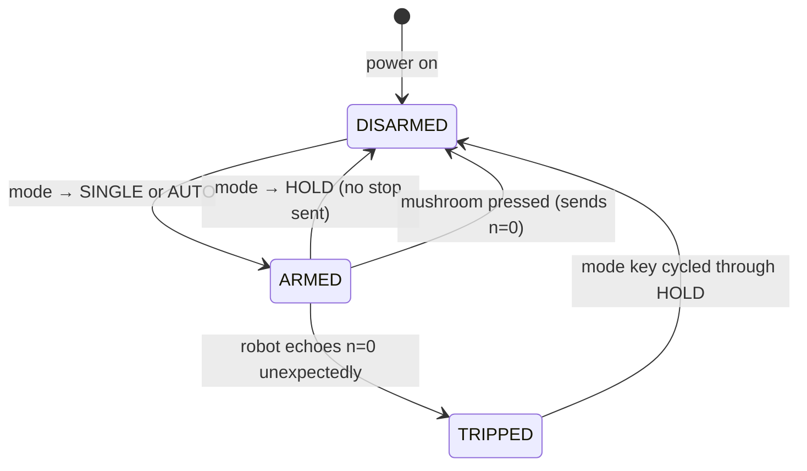

# Description of Operation — Home Unit

> UX pillar of the UUV Secondary Safety System.
> Full panel layout: [`panel-sketch.html`](panel-sketch.html) · Protocol: [`../02-protocol/README.md`](../02-protocol/README.md) · Hardware: [`../01-platform-hardware/README.md`](../01-platform-hardware/README.md)

---

## Overview

The home unit continuously exchanges 3-byte acoustic packets with the UUV. The robot sends a
challenge (nonce + echoed lease level); the home responds with an authenticated lease grant. The
robot's motor relays stay closed only while a valid, unexpired lease is held. Losing the link or pressing UN-ARM cause the robot to stop within the lease window. Moving the
mode key to HOLD stops new grants but lets any existing lease expire naturally.

---

## Controls

| Control | Positions / Action | Notes |
|---|---|---|
| ON / OFF | Rocker | Power |
| MODE KEY | **HOLD** (centre) · **SINGLE** (left) · **AUTO** (right) | Always turnable; key removable only at HOLD |
| PROGRAM KEY | **DOWN** ÷2 (left) · **KEEP** (centre) · **UP** ×2 (right) | Always turnable; key removable only at KEEP |
| UN-ARM mushroom | Momentary press | Press: latches; sends stop, cuts motors · Click again to release visual latch |

**MODE KEY positions:**

| Position | Home behaviour |
|---|---|
| HOLD | No new grants sent; existing lease expires naturally; key may be removed. Does **not** send a stop packet. |
| SINGLE | Grants sent on every challenge while key is held; springs back to HOLD on release. Same grant rate as AUTO while held. |
| AUTO | Grants sent on every challenge; stays latched until key moved to HOLD. |

**PROGRAM KEY**: UP multiplies lease time by 2; DOWN divides by 2. Range n = 1–15
(2 s → 32 768 s). Changes take effect immediately on the LEASE display. Key position is always
accepted; the new value applies on the next grant sent.

---

## Indicators

### LEDs

| LED | State | Meaning |
|---|---|---|
| POWER | Green solid | Unit powered |
| LINK | Blue solid | Ethernet path to robot IP is up |
| LINK | Off | No route to robot IP |
| ROBOT | Green flash | Challenge received; robot echoes n = 0 (no active lease — safe/stopped) |
| ROBOT | Red flash | Challenge received; robot echoes n ≥ 1 (holds active lease — running) |
| ROBOT | Off | No challenge received recently |
| ARMED | Green solid | Disarmed (HOLD mode); home is not granting leases |
| ARMED | Red 1 Hz blink | Armed (SINGLE or AUTO); home is actively granting leases |
| FAULT | Amber solid | Robot held a lease then echoed n = 0 unexpectedly (watchdog / trip) |

**ROBOT LED** flashes briefly (≈ 100 ms) on every challenge packet received. The flash colour
reflects the robot's current lease status: **green** = robot reports no active lease (n = 0, safe
or stopped); **red** = robot holds an active lease (n > 0, running). Between flashes the LED is
dark. Absence of flashes for > 3 × T indicates the acoustic/network link is lost.

**ARMED LED** is green solid when disarmed (mode = HOLD). It blinks red at 1 Hz whenever armed
(mode = SINGLE or AUTO and power is on), providing a continuous warning that lease grants are
being sent.

### Screen

```
LEASE      08:32   n=9
REMAINING  04:17   n=9
  ROBOT    n=9 ✓
```

All times displayed as `H:MM:SS` when ≥ 1 hour, `MM:SS` when < 1 hour. Small `n=X` annotation
shown alongside each time value.

| Row | Content | All possible values |
|---|---|---|
| LEASE | Run time that will be granted | `MM:SS  n=X` · blinks 5 s while PROGRAM key unlocked |
| REMAINING | Time left on lease (may be slightly less) | `MM:SS  n=X` · `STOPPED` · `------` (no active lease) |
| ROBOT | Robot's last echoed n | `n=X ✓` confirmed · `n=X ⚠` in flight · `n=0` stopped · `TRIPPED` latch active · `------` no data |

**REMAINING "may be slightly less":** the display shows an upper bound (see §Countdown Logic). The
robot's actual remaining time is at most `max_age` seconds less than shown.

---

## Countdown Logic (REMAINING)

**Invariant: `displayed_remaining ≥ actual_remaining` at all times.**

The robot starts its lease countdown only after the one-way acoustic delay Δ. The nonce
`max_age` parameter bounds Δ, so:

```
display  =  (2^n_last_sent + max_age)  −  elapsed_since_send
actual   =  (2^n_last_sent + Δ)        −  elapsed_since_send   [Δ ≤ max_age]
∴  display ≥ actual
```

| Event | REMAINING action |
|---|---|
| Grant sent with n ≥ previous n | Reset deadline: `now + 2^n + max_age` |
| AUTO cycle renewal (same n) | Reset deadline each cycle — display stays near ceiling |
| Grant sent with lower n | **No change** — keep current deadline |
| Mushroom pressed / n=0 sent | **No change** — keep current deadline |
| Robot echoes n = 0 | Home latches (TRIPPED); REMAINING keeps counting to zero; ROBOT row → `TRIPPED` |
| Deadline reached (display = 0) | Display → `STOPPED`; robot is definitely not running |

The maximum overestimate is `max_age`. For leases ≥ 64 s (n ≥ 6) this is < 5 % overhead.

---

## State Machine

PENDING and ACTIVE collapse into a single ARMED state — home behaviour is identical in both
(grants sent on every challenge, ARMED LED red blink). REMAINING display handles the distinction:
`------` until the robot's first echoed confirmation, then countdown. TRIPPED is kept as a
separate state because it requires a deliberate acknowledgement (mode key through HOLD) before
re-arming; without it the operator could accidentally re-arm immediately after an unexpected stop.
Mushroom is a cross-cutting override: while latched it sends n=0 on every challenge regardless of
the current state, then resumes state behaviour on release.



**State outputs:**

| State | Sends | ARMED LED | REMAINING |
|---|---|---|---|
| DISARMED | Nothing | Green solid | `------` |
| ARMED | Grant on each challenge | Red blink | `------` until first confirmation, then countdown |
| TRIPPED | Nothing | Green solid | Counting to zero, then `STOPPED` |
| Mushroom override (any state) | n=0 on each challenge | Green blink | No change |

---

## Operating Sequences

### AUTO mode — continuous operation

```
Operator: mode → AUTO
Home:     state = ARMED; ARMED LED → red blink
Robot:    sends challenge (nonce, echoed n=0 initially)
Home:     computes grant, sends [n:4 | R:20]; REMAINING = 2^n + max_age
Robot:    accepts grant → relays close → echoes n in next challenge
Home:     ROBOT LED → red flash (n>0); ROBOT row → n=X ✓
          REMAINING begins countdown
          [each cycle T seconds:]
          receives challenge → sends grant → REMAINING deadline reset
          ROBOT flashes red (robot is running); ARMED blinks red
```

### SINGLE mode — held momentary

```
Operator: holds mode key at SINGLE
Home:     state = ARMED; ARMED LED → red blink
          [sends grant on every challenge, same as AUTO, while key is held]
Robot:    sends challenge; receives grant → relays close → echoes n
Home:     ROBOT → red flash (n>0); ROBOT row → n=X ✓
          REMAINING = 2^n + max_age; counting down; resets each cycle
Operator: releases SINGLE key → springs back to HOLD
Home:     mode = HOLD; no stop sent; ARMED LED → green solid
          Robot holds current lease; relays open when lease expires
```

### Stop by mushroom

```
Operator: presses UN-ARM mushroom
Home:     sends n=0 on each challenge while held
          ARMED LED → green solid; REMAINING: no change
Robot:    receives n=0 → relays open (within max_age of receipt)
          next challenge echoes n=0
Home:     ROBOT → green flash (n=0); ROBOT row → n=0
Operator: clicks mushroom again to release visual latch
Home:     resumes sending grants (if mode is SINGLE or AUTO)
          ARMED LED → red blink; REMAINING resets on next grant
```

### Remote trip (robot watchdog fires)

```
Robot:    watchdog fires (lease expired, fault)
          relays open; echoes n=0 in next challenge
Home:     receives n=0 echo → state = TRIPPED
          stops sending grants; ARMED LED → green solid
          ROBOT → green flash (n=0); ROBOT row → TRIPPED
          REMAINING: keeps counting down to STOPPED
          (in-flight grants may briefly re-arm robot; no new grants follow)
Recovery: mode key cycled through HOLD → state = DISARMED; operator re-arms normally
```

### Lease change

```
Operator: mode → HOLD (stops new grants; robot runs out current lease)
          PROGRAM key UP or DOWN → LEASE display updates immediately
          mode → SINGLE (hold) or AUTO to re-arm with new lease value
```

---

## Key Parameters

| Parameter | Role | Typical value |
|---|---|---|
| `n` | Lease exponent (home selects, 1–15) | 2ⁿ seconds |
| `T` | Challenge send interval (robot) | ≈ lease / 4 |
| `K` | Nonce buffer depth (robot) | ≈ round-trip / T |
| `max_age` | Nonce validity window | Worst-case acoustic RTT + margin |
| REMAINING offset | `max_age` added to countdown | Ensures display ≥ actual |

---

## Implementation Reference

### LED timing

| LED | Event | Behaviour |
|---|---|---|
| ROBOT | Challenge received; echoed n = 0 | Green on for 100 ms, then off |
| ROBOT | Challenge received; echoed n ≥ 1 | Red on for 100 ms, then off |
| ROBOT | No challenge received recently | Off |
| LINK | Route to robot IP exists | Solid blue |
| LINK | No route to robot IP | Off |
| ARMED | Disarmed (mode = HOLD) | Solid green |
| ARMED | Armed (mode = SINGLE or AUTO) | Red 1 Hz blink (500 ms on / 500 ms off) |
| POWER | Powered | Solid green (static) |
| FAULT | Robot held lease, then echoed n=0 | Solid amber |

### Screen format

```c
// LEASE row
"  LEASE   %02d:%02d   n=%d"    // MM:SS when < 1h
"  LEASE %d:%02d:%02d   n=%d"   // H:MM:SS when >= 1h
// blink LEASE label at 2 Hz for 5 s while PROGRAM key is unlocked

// REMAINING row — normal
"REMAINING %02d:%02d   n=%d"
// REMAINING row — terminal states
"REMAINING STOPPED"
"REMAINING ------"              // disarmed, no active lease

// ROBOT row
"  ROBOT   n=%d ✓"         // confirmed (✓)
"  ROBOT   n=%d ⚠"         // in flight (⚠)
"  ROBOT   n=0"                 // stopped
"  ROBOT   TRIPPED"             // latch active
"  ROBOT   ------"              // no data
```

### Boot / init state

```
state       = DISARMED
REMAINING   = "------"
ROBOT row   = "------"
LEASE       = last value from NV storage (or n=6 / 64 s if no stored value)
ARMED LED   = green solid (disarmed)
ROBOT LED   = off (no challenges received yet)
LINK LED    = blue if ethernet path to robot IP is up, else off
POWER LED   = green solid
```

### Home main loop (pseudocode)

```python
# Runs on home MCU; period ~10 ms

state = DISARMED   # DISARMED | ARMED | TRIPPED
remaining_deadline = 0   # absolute time; REMAINING = deadline - now()
last_rx_time = 0
echo_n = 0               # last echoed n received from robot

loop:
    # ── Receive ──────────────────────────────────────────────
    pkt = acoustic_rx_nonblocking()
    if pkt:
        echo_n   = pkt >> 20          # top 4 bits
        nonce    = pkt & 0xFFFFF      # bottom 20 bits
        last_rx_time = now()

        led_robot_flash(GREEN if echo_n == 0 else RED)  # 100 ms; green=safe, red=running

        if echo_n == 0 and state == ARMED:
            state = TRIPPED            # unexpected stop — latch, stop sending

        if state == ARMED and not mushroom_held():
            n = selected_n()          # from PROGRAM key (only while mushroom held)
            R = truncate20(HMAC_SHA256(key, bytes([nonce >> 12,
                                                   (nonce >> 4) & 0xFF,
                                                   ((nonce & 0xF) << 4) | n])))
            acoustic_tx((n << 20) | R)
            # ARMED LED: continuous red-blink while state==ARMED

            new_deadline = now() + (1 << n) + max_age
            if new_deadline > remaining_deadline:
                remaining_deadline = new_deadline   # only extend, never shorten

    # ── Controls ─────────────────────────────────────────────
    if mode_key() == HOLD:
        if state == ARMED:
            state = DISARMED        # no n=0 sent; existing lease expires naturally
        led_armed_green()

    if mushroom_held():
        # selected_n() returns 0 while held → sends n=0 on next challenge
        led_armed_green_blink()

    if mode_key() in {SINGLE, AUTO} and state == DISARMED:
        state = ARMED
        led_armed_blink_red()

    if state == TRIPPED and mode_key_cycled_through_hold():
        state = DISARMED
        remaining_deadline = 0

    # ── LINK LED ─────────────────────────────────────────────
    # Physical/network layer only: is the ethernet path to the robot IP up?
    # Arduino: Ethernet.linkStatus() == LinkON
    # Sim:     connect() routing probe to robot IP succeeds
    led_link_solid() if ethernet_link_up() else led_link_off()

    # ── REMAINING display ────────────────────────────────────
    if remaining_deadline > 0:
        rem = remaining_deadline - now()
        if rem > 0 and not (echo_n == 0 and elapsed_since_last_grant() >= max_age):
            screen_remaining(rem)
        else:
            screen_remaining_stopped()
            if state == ARMED:      # deadline expired while still armed
                state = TRIPPED
    else:
        screen_remaining_dashes()

    # ── ROBOT row ────────────────────────────────────────────
    if last_rx_time == 0:
        screen_robot_nodata()
    elif state == TRIPPED:
        screen_robot_tripped()
    elif echo_n == 0:
        screen_robot_stopped()
    elif echo_n == selected_n():
        screen_robot_confirmed(echo_n)    # n=X ✓
    else:
        screen_robot_inflight(echo_n)     # n=X ⚠
```

**Note on SINGLE mode:** the MODE KEY is a spring-return momentary switch. While held at SINGLE it
sends grants on every challenge (same rate as AUTO). When released it springs back to HOLD — the
firmware detects `mode = HOLD` and transitions to DISARMED. No stop packet is sent; REMAINING keeps
counting while the robot holds the existing lease.

### MAC / key

MAC algorithm: **HMAC-SHA256**, truncated to 20 bits (top 20 bits of digest).

Input to HMAC: 3-byte big-endian encoding of `(nonce[19:0] << 4) | n[3:0]` — i.e., the same
bit-layout as the response packet `[n:4 | nonce:20]` read as a 3-byte value, but with n in the
low nibble and nonce in the upper 20 bits.

```
msg[0] = nonce >> 12
msg[1] = (nonce >> 4) & 0xFF
msg[2] = ((nonce & 0xF) << 4) | n
R = HMAC_SHA256(key, msg)[0:20 bits]
```

Key provisioning: key is a 32-byte value written to non-volatile storage at manufacture. The
same key is flashed to both the home unit and the UUV board. For multi-UUV deployments use
`key_i = HKDF(master_key, UUV_serial)`.

### IO signals (Teensy 4.1 prototype)

| Signal | Direction | Notes |
|---|---|---|
| MODE KEY (3 pos) | In | Two GPIO pins encoding HOLD/SINGLE/AUTO |
| PROGRAM KEY (3 pos) | In | Two GPIO pins encoding DOWN/KEEP/UP |
| UN-ARM mushroom | In | Active-low GPIO; internal pull-up |
| ROBOT LED | Out | RGB LED; R + G channels; PWM for flash timing |
| LINK LED | Out | Blue channel or separate LED |
| ARMED LED | Out | Red LED; PWM for blink-off pulse |
| POWER LED | Out | Green LED; static |
| FAULT LED | Out | Red LED; driven by hardware supervisor too |
| Screen | Out | I²C or SPI to character/OLED display |
| Acoustic modem | In/Out | UART; 3-byte framing |
| Watchdog kick | Out | To hardware watchdog (robot-side only; home has no watchdog kick) |
